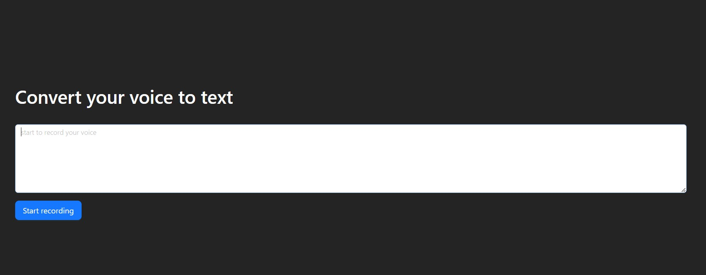

# Voice to Text Converter

This project is a voice-to-text converter application built with React and Ant Design. The application allows users to start and stop voice recording and converts the recorded voice into text.

## Features

Voice recording: Start and stop recording with buttons.

Text conversion: Converts recorded voice to text in real-time with the possibility of correction via keyboard.

User-friendly interface using Ant Design components.

## Technology stack

React.js, Ant Design
